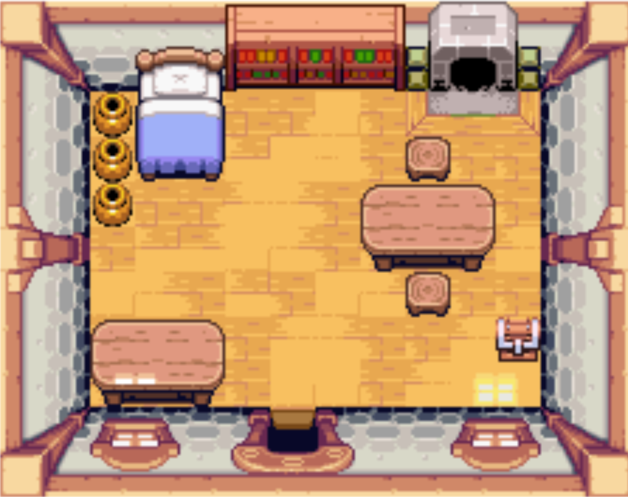
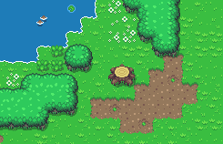

<h1>Zelda</h1> 
Petit jeu en C avec la bibliothèque SDL 2.0
 
 
<ul><li>encore en cour de création</li>
    <ul>
        <li>rentrer dans la maison</li>
        <li>aller plus loin dans la map</li>
        <li>Célébration de Link</li>
    </ul>
</ul>
<h2>Jouer au jeu</h2>

il faut exécuter prog.exe a l'aide d'un Shell

- <em>prog.exe</em> se situe dans le dossier bin >> bin\prog.exe

<h2>Les commandes du jeu :</h2>
<ul>
    <li>
        <strong>droite :</strong> flèche de droite du pavé numérique
    </li>
    <li>
        <strong>gauche :</strong> flèche de gauche du pavé numérique
    </li>
    <li>
        <strong>bas :</strong> flèche du bas du pavé numérique
    </li>
    <li>
        <strong>haut :</strong> flèche du haut du pavé numérique
    </li>
    <li>
        <strong>sortir épée :</strong> escpace
    </li>
    <li>
        <strong>Quitter :</strong> Touche échape
    </li>
    <li>
        <strong>Célébration :</strong> Touche C    
    </li>
</ul>

 
<table>
    <tr>
        <td>
            
        </td>
        <td>
            
        </td>
    </tr>
    <tr>
        <td>
            
        </td>
    </tr>
</table>

 
<table>
<tr>
        <td>
            
        <td>
        <td>
            
        </td>
        <td>
            
        </td>
    </tr>
    <tr>
        <td>
            
        <td>
        <td>
            
        </td>
        <td>
            
        </td>
    </tr>
    <tr>
        <td>
            
        <td>
        <td>
            
        </td>
        <td>
            
        </td>
    </tr>
    <tr>
        <td>
            
        <td>
        <td>
            
        </td>
        <td>
            
        </td>
    </tr>
</table>
