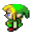

<h1>Zelda</h1> 
Petit jeu en C avec la bibliothèque SDL 2.0
 
 
<ul><li>l'utilisation de l'épée</li>
<li>rentrer dans la maison</li>
<li>aller plus loin dans la map est encore en cour de création</li>

<h2>Jouer au jeu</h2>

il faut exécuter prog.exe a l'aide d'un Shell

- <em>prog.exe</em> se situe dans le dossier bin >> bin\prog.exe

<h2>Les commandes du jeu :</h2>
<ul>
    <li>
        <strong>droite :</strong> flèche de droite du pavé numérique
    </li>
    <li>
        <strong>gauche :</strong> flèche de gauche du pavé numérique
    </li>
    <li>
        <strong>bas :</strong> flèche du bas du pavé numérique
    </li>
    <li>
        <strong>haut :</strong> flèche du haut du pavé numérique
    </li>
    <li>
        <strong>sortir épée :</strong> escpace (<em>encore en cour de création</em>)
    </li>
    <li>
        <strong>Quitter :</strong> Touche échape
    </li>
</ul>

 

 
|  |  |  |  |
| -------- | -------- | ------------- | ------- |
||  |  |
| |  |  | Confinement |
| Expérience travail d'équipe/projet | Premier projet Java |   | Connexion Internet |
| Base en gestion de projet |  |  |   |
| Outils de réunion (Discord) |  |  |  |
